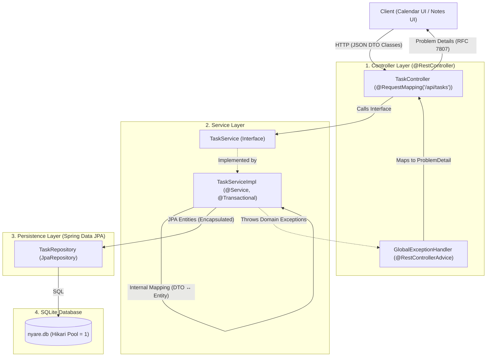

# Nyare Backend Conventions and Standards

This document serves as the canonical reference for architecture, design patterns, coding conventions, and verification standards across the Nyare backend.

---

## 1. Architecture Overview

Nyare follows a strict layered architecture with clear boundaries between persistence, business logic, and presentation:



### Layer Responsibilities & Isolation Rules

1. **Controller Layer (`group.four.nyare.nyare.controller`)**:
   - Handles HTTP routing, input validation (`@Valid`), status codes, and HTTP headers.
   - Interacts **only** with Service interfaces and DTOs.
   - Never accesses Repositories or JPA Entities directly.
2. **Service Layer (`group.four.nyare.nyare.service`)**:
   - Contains all business logic, validation of cross-entity rules, and transaction boundaries (`@Transactional`).
   - Defined as an **Interface** in `service` and implemented in `service.impl`.
   - Maps between internal JPA Entities and external DTOs. Entities must never escape past this layer.
3. **Persistence Layer (`group.four.nyare.nyare.repository`)**:
   - Spring Data JPA interfaces extending `JpaRepository` or `CrudRepository`.
   - Encapsulates queries and database operations.
4. **Domain Model (`group.four.nyare.nyare.model`)**:
   - JPA Entities and domain enums.
   - Internal to persistence and service layers.

---

## 2. Package Structure & Naming

All subpackages are **strictly lowercase** to comply with standard Java conventions:

```text
src/main/java/group/four/nyare/nyare/
├── NyareApplication.java             # Main class + @EnableJpaAuditing
├── controller/                       # REST controllers
│   ├── TaskController.java
│   └── GlobalExceptionHandler.java   # Centralized RFC 7807 handler
├── service/                          # Service interfaces
│   ├── TaskService.java
│   └── impl/
│       └── TaskServiceImpl.java      # Service implementations
├── repository/                       # Spring Data JPA repositories
│   ├── TaskRepository.java
│   └── CourseRepository.java
├── model/                            # JPA Entities & domain enums
│   ├── Task.java
│   ├── Course.java
│   ├── Note.java
│   ├── AcademicEvent.java
│   ├── AcademicContext.java
│   ├── Schedule.java
│   └── enums/
│       └── TaskStatus.java
├── dto/                              # Request/Response POJO classes
│   ├── TaskRequest.java
│   ├── TaskResponse.java
│   └── TaskStatusRequest.java
└── exception/                        # Domain runtime exceptions
    ├── ResourceNotFoundException.java
    └── BadRequestException.java
```

---

## 3. Domain Entity Guidelines

1. **Identifier Strategy**:
   - `Course`: `Long` with `@GeneratedValue(strategy = GenerationType.IDENTITY)`.
   - `Task`, `Note`, `AcademicEvent`, `AcademicContext`: `UUID` with `@GeneratedValue(strategy = GenerationType.UUID)`.
2. **Naming Strategy (No Redundant Column Names)**:
   - Hibernate's `CamelCaseToUnderscoresNamingStrategy` maps field names automatically:
     - `createdAt` $\rightarrow$ `created_at`
     - `scheduledDate` $\rightarrow$ `scheduled_date`
     - `courseId` $\rightarrow$ `course_id`
   - **Do NOT** specify `name = "..."` manually on `@Column` unless overriding a legacy non-standard name.
   - Use `@Column` only when defining database constraints: e.g. `@Column(nullable = false, length = 255)`.
3. **No `equals()` / `hashCode()` Bloat (YAGNI)**:
   - Entities remain strictly within the service transaction and are never added to detached `Set`s across sessions.
   - Rely on default Java `Object.equals()` and `hashCode()` (instance identity). Do not write custom 20-line boilerplate methods.
4. **Auditing Fields**:
   - Entities tracking timestamps must include:
     ```java
     @CreatedDate
     @Column(nullable = false, updatable = false)
     private Instant createdAt;

     @LastModifiedDate
     private Instant updatedAt;
     ```
   - Ensure the entity class is annotated with `@EntityListeners(AuditingEntityListener.class)`.
5. **Relationship Fetching**:
   - All `@ManyToOne` and `@OneToMany` associations must declare `fetch = FetchType.LAZY`.
   - Traversal of lazy associations must occur inside `@Transactional` service methods (`spring.jpa.open-in-view=false`).
6. **Core MVP Boundaries**:
   - `StudyPlan` is a virtual UI construct; **never** create a table or entity for it.
   - Deadlines (`AcademicEvent.deadline`) are fixed rigid constraints; task dates (`Task.scheduledDate`) are flexible suggestions (`null` = Later).

---

## 4. DTO & Validation Guidelines

1. **Class-Based POJOs**:
   - DTOs are standard Java classes with no-argument constructors, all-argument constructors, and getters/setters.
   - Request DTOs: named `XxxRequest` (e.g. `TaskRequest`, `TaskStatusRequest`).
   - Response DTOs: named `XxxResponse` (e.g. `TaskResponse`).
2. **Bean Validation**:
   - Declare Jakarta validation annotations directly on request DTO fields:
     ```java
     public class TaskRequest {
         @NotNull(message = "Course ID is required")
         private Long courseId;

         @NotBlank(message = "Task title is required")
         @Size(max = 255, message = "Task title cannot exceed 255 characters")
         private String title;

         private String description;
         private LocalDate scheduledDate;
         private Duration duration;
         private TaskStatus status;

         // Constructors, getters, setters
     }
     ```
3. **Manual Service Mapping**:
   - The service implementation maps explicitly between entities and DTOs using straightforward Java methods:
     ```java
     private TaskResponse toResponse(Task task) {
         TaskResponse res = new TaskResponse();
         res.setId(task.getId());
         res.setCourseId(task.getCourse().getId());
         res.setNoteId(task.getNote() != null ? task.getNote().getId() : null);
         res.setTitle(task.getTitle());
         res.setDescription(task.getDescription());
         res.setScheduledDate(task.getScheduledDate());
         res.setDuration(task.getDuration());
         res.setStatus(task.getStatus());
         res.setCreatedAt(task.getCreatedAt());
         res.setUpdatedAt(task.getUpdatedAt());
         return res;
     }
     ```

---

## 5. Service & Transaction Guidelines

1. **Interface + Implementation**:
   - Define business contracts in `service/XxxService.java`.
   - Implement logic in `service/impl/XxxServiceImpl.java` annotated with `@Service`.
2. **Transaction Demarcation**:
   - Class-level: `@Transactional(readOnly = true)` to optimize read operations and disable unnecessary Hibernate dirty checks.
   - Mutating methods (`create`, `update`, `delete`): explicit `@Transactional`.
3. **Exception Handling**:
   - Services validate references (e.g., verifying that a `courseId` exists) and throw domain exceptions (e.g., `ResourceNotFoundException("Course not found: " + courseId)`).
   - Services must never return HTTP status codes or `ResponseEntity`.

---

## 6. REST API & Controller Guidelines

1. **Unversioned Paths**:
   - Endpoints start with `/api/...` (no `/v1/` prefix).
   - Use plural nouns in kebab-case: `/api/tasks`, `/api/courses`, `/api/academic-events`.
2. **HTTP Verb & Status Code Matrix**:
   | Action | HTTP Verb | Path | Success Status | Error Statuses |
   |---|---|---|---|---|
   | List (filtered) | `GET` | `/api/tasks?courseId=1&status=TODO` | `200 OK` | `400 Bad Request` |
   | Get by ID | `GET` | `/api/tasks/{id}` | `200 OK` | `404 Not Found` |
   | Create | `POST` | `/api/tasks` | `201 Created` (`Location` header) | `400 Bad Request`, `404 Not Found` (Course) |
   | Update Full | `PUT` | `/api/tasks/{id}` | `200 OK` | `400 Bad Request`, `404 Not Found` |
   | Update Status | `PATCH` | `/api/tasks/{id}/status` | `200 OK` | `400 Bad Request`, `404 Not Found` |
   | Delete | `DELETE` | `/api/tasks/{id}` | `204 No Content` | `404 Not Found` |
3. **No Paging (MVP)**:
   - Endpoints return simple `List<T>`, avoiding unnecessary pagination wrappers.
4. **RFC 7807 Problem Details**:
   - All errors return standard `ProblemDetail` payloads managed by `GlobalExceptionHandler` (`@RestControllerAdvice`).

---

## 7. Persistence & SQLite Guidelines

1. **Single-Writer Pool**:
   - `spring.datasource.hikari.maximum-pool-size=1` is strictly required to prevent SQLite locking collisions.
2. **Schema Management**:
   - `spring.jpa.hibernate.ddl-auto=update` is used during active development.
3. **Open-In-View Disabled**:
   - `spring.jpa.open-in-view=false` ensures all entity interaction stays inside the service transaction.

---

## 8. Verification & Testing Standards

1. **Test Slices**:
   - **Service Tests**: Pure unit tests using JUnit 5 + Mockito (`@ExtendWith(MockitoExtension.class)`). Do not load Spring context.
   - **Controller Tests**: `@WebMvcTest` with `MockMvc` verifying HTTP routing, validation, status codes, and JSON response.
   - **Repository Tests**: `@DataJpaTest` verifying custom queries and database constraints.
2. **Conventions**:
   - Use AssertJ (`assertThat(...)`) for assertions.
   - Structure tests with `// given`, `// when`, `// then`.
   - Naming convention: `methodName_condition_expectedBehavior`.
