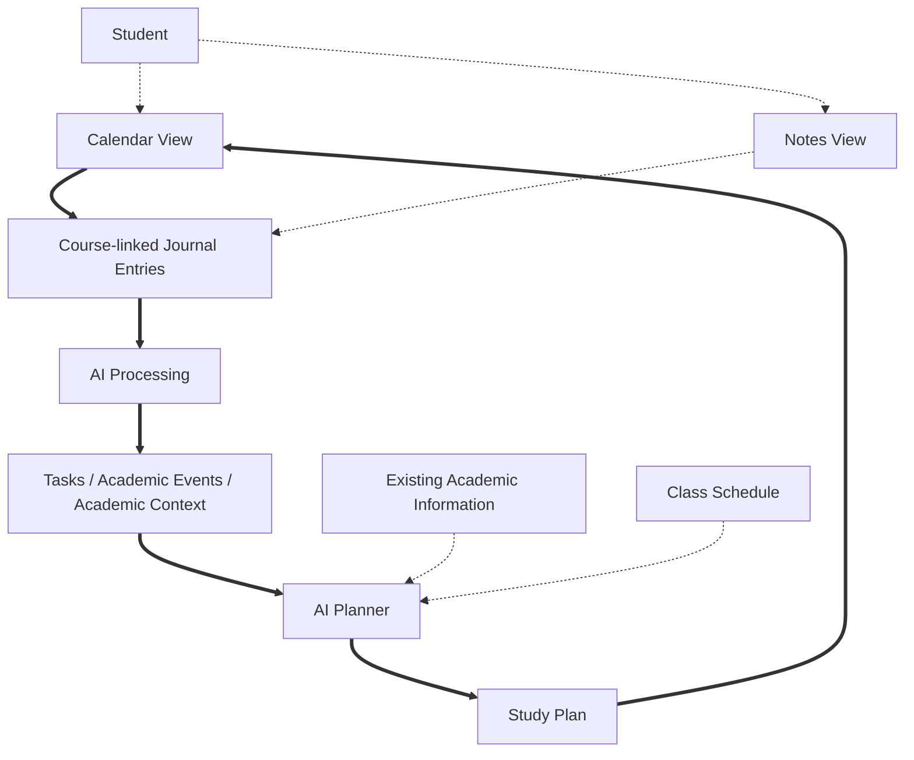
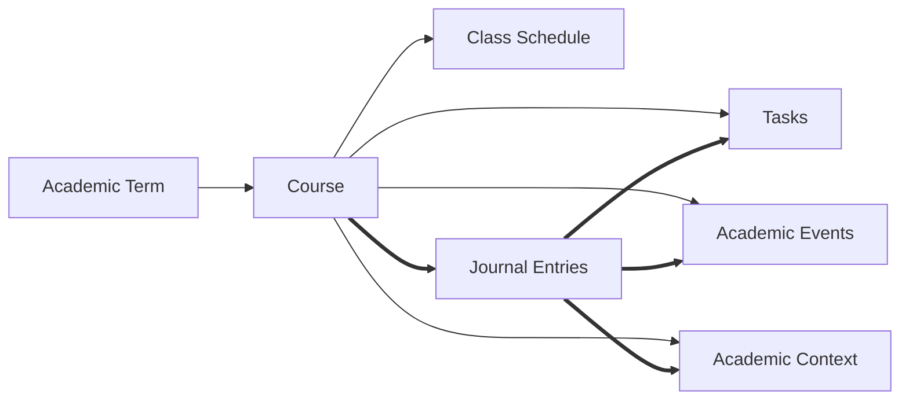
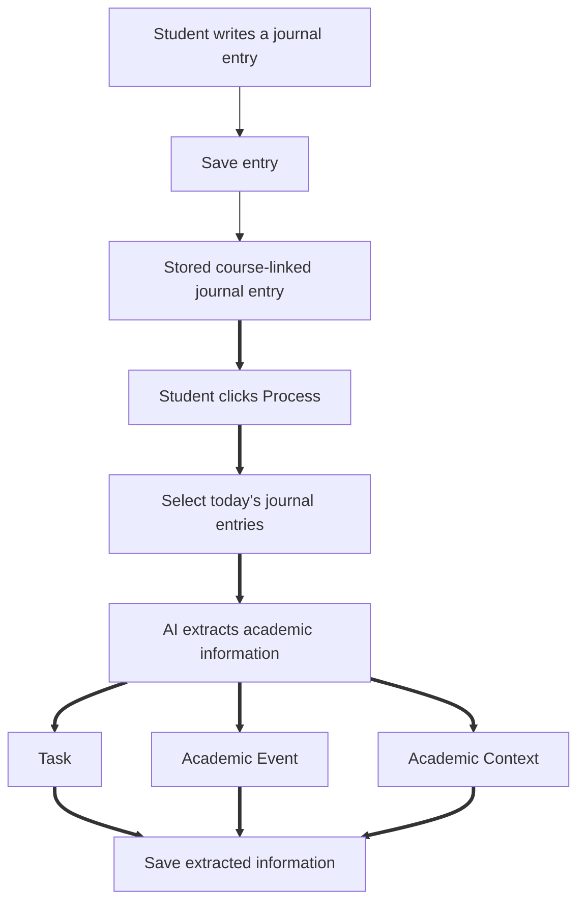
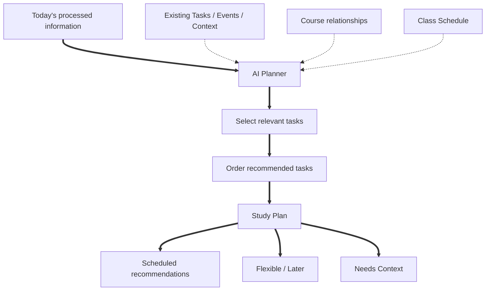
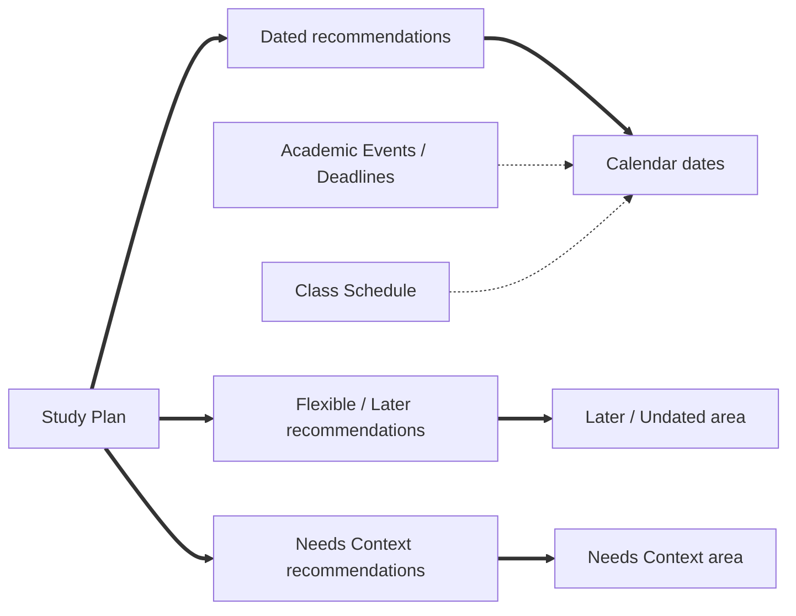
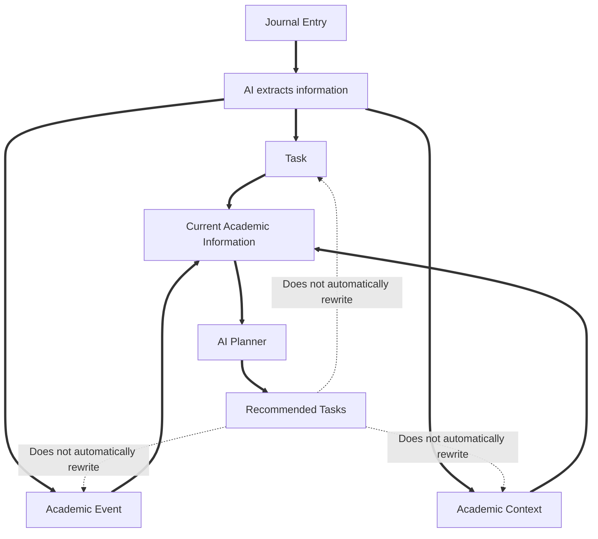
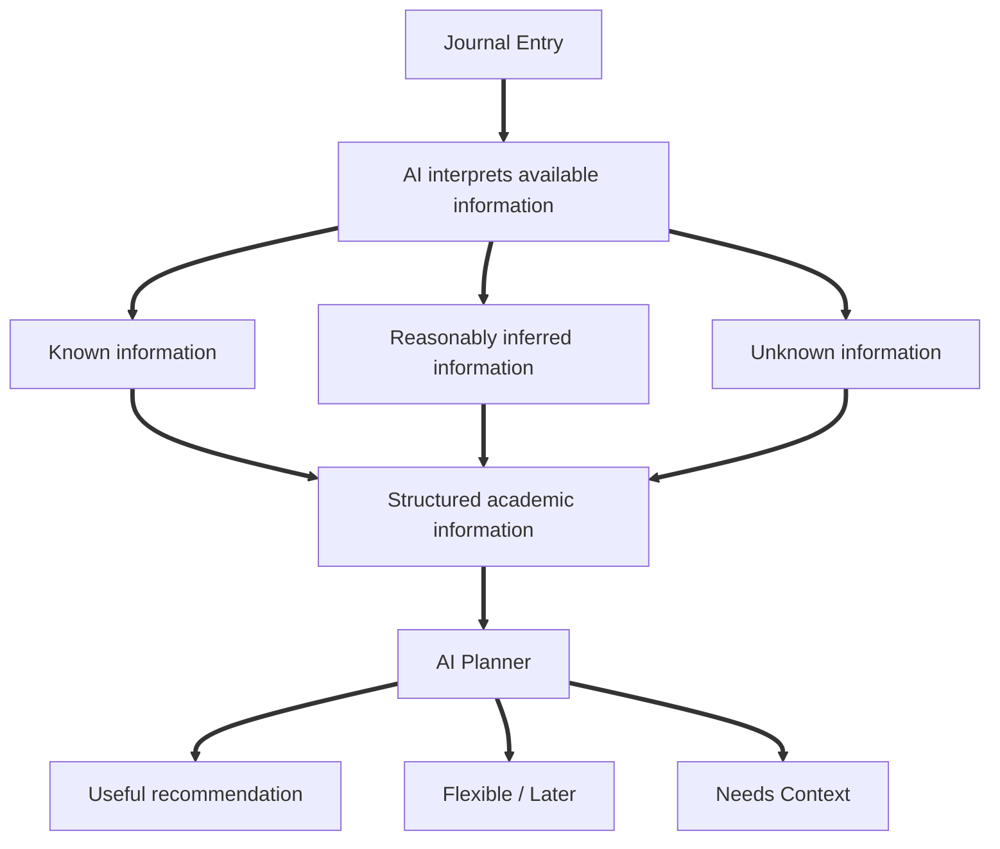
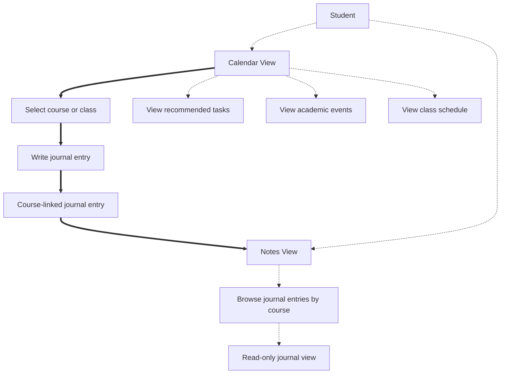
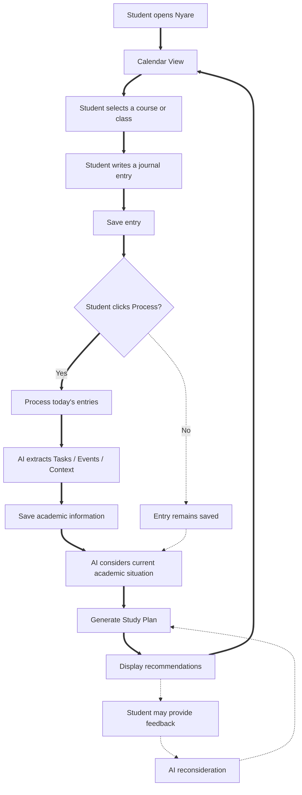

# Nyare System Workflows & Architecture Diagrams

This document formalizes the 9 architectural workflows of Nyare. These diagrams define information flow, operational boundaries, and UI navigation contracts across the application.

---

## Workflow Directory

| # | Workflow | Primary Purpose |
| :-: | :--- | :--- |
| 1 | [System Overview](#1-system-overview) | End-to-end component topology and primary cycles |
| 2 | [Core Academic Model](#2-core-academic-model) | Entity relationships and journal ingestion structure |
| 3 | [Journal Processing Workflow](#3-journal-processing-workflow) | Explicit AI extraction scoped to today's notes |
| 4 | [AI Planning Workflow](#4-ai-planning-workflow) | Multi-input synthesis into the tri-state Study Plan |
| 5 | [Study Plan & Calendar Relationship](#5-study-plan-and-calendar-relationship) | UI mapping to Calendar grid, Later area, and Needs Context area |
| 6 | [Information & Planning Boundaries](#6-information-and-planning-boundaries) | Append-only materialization without automated entity mutation |
| 7 | [Handling Missing Information](#7-handling-missing-information) | Known, Inferred, and Unknown handling without data fabrication |
| 8 | [User Interface & Navigation](#8-user-interface-and-navigation) | Calendar View hub and read-only Notes View navigation |
| 9 | [Complete MVP Lifecycle](#9-complete-mvp-lifecycle) | Full user flow including student feedback and AI reconsideration |

---

### 1. System Overview

Shows what Nyare is and how its major runtime components connect. The Calendar View is the student's home cockpit. Journal entries are linked to courses, AI extracts structured academic knowledge, and the AI Planner synthesizes recommendations back into the Calendar.

---

### 2. Core Academic Model

Shows how courses anchor academic entities, and how journal entries act as the primary ingestion engine for Tasks, Academic Events, and Academic Context.

*Key principle*: Every journal entry belongs to exactly one course. All extracted academic entities inherit this course association.

---

### 3. Journal Processing Workflow

Details how student notes transition into structured database entities. Processing is **explicit** (triggered by the student clicking "Process") and strictly scoped to **today's journal entries**.

---

### 4. AI Planning Workflow

Shows how the AI Planner selects and orders tasks into a coherent Study Plan. The planner takes into account newly processed notes, existing tasks, academic events, class schedules, and course context.

---

### 5. Study Plan and Calendar Relationship

Illustrates the tri-state routing of Study Plan recommendations onto the user interface.

- **Calendar Grid**: Displays class meeting times, rigid Academic Events / Deadlines, and **Scheduled** tasks with recommended dates.
- **Later Area**: Displays actionable **Flexible / Later** tasks without specific target dates.
- **Needs Context Area**: Displays actionable items that require additional information before confident planning can occur.

---

### 6. Information and Planning Boundaries

Defines how the system preserves integrity by treating materialization as append-only. Recommendations **do not automatically overwrite or reconcile** existing records.

---

### 7. Handling Missing Information

Demonstrates how Nyare handles missing or incomplete information. The system preserves uncertainty rather than inventing facts.

- When deadline or duration is unknown, it remains empty.
- If plannability is low, the item is routed to **Needs Context** or **Flexible / Later**.

---

### 8. User Interface and Navigation

Defines the screen navigation model: Calendar View is the interactive home, while Notes View is a read-only browser.

---

### 9. Complete MVP Workflow

Shows the complete end-to-end user lifecycle from app startup to student feedback and AI reconsideration.

*Feedback Loop*: When the student provides feedback (e.g. *"I have no time tonight"*), the feedback is incorporated into the planning context and the AI reconsiders task recommendations without mutating underlying Task or Event records.
